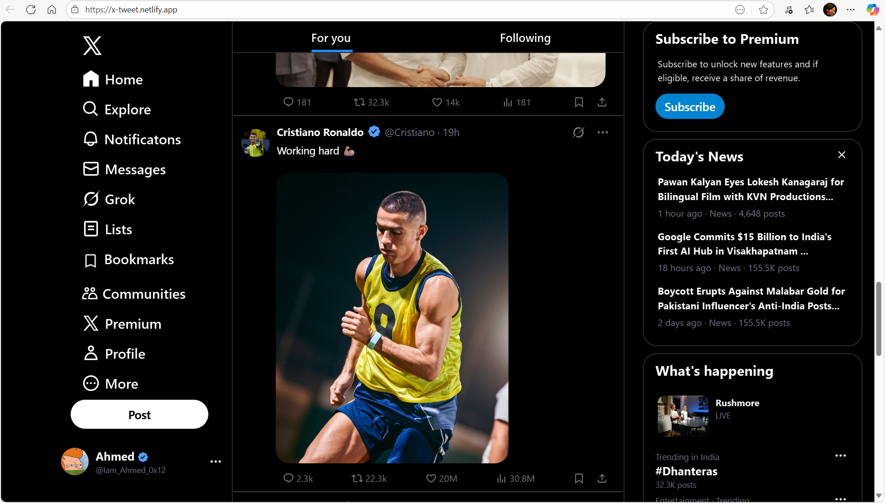

# X-clone

  
  <h1>X (Twitter) Clone</h1>
  
A modern and responsive Twitter (X) clone built with <b>Tailwind CSS</b>.

  

    
    
    
  

---

## 🖥️ Overview  

This project is a **static clone of the X (formerly Twitter) Home Page**, designed using **Tailwind CSS**.  
It focuses on **layout, responsiveness, and design accuracy** — capturing the essence of the official X interface.

---

🌐 Live Demo

🔗 Live URL: https://x-tweet.netlify.app/

## 🖼️ Screenshots  

> 🏠 **Home Page View**  
.

> 📱 **Mobile View**  

> 💻 **Desktop View**  

## 🚀 Features  

- 📱 Fully responsive layout  
- 🎨 Styled entirely with TailwindCSS utilities  
- ⚡ Clean and minimal user interface  
- 🧩 Structured for scalability (easy to add other pages later)  
- 💻 Fast and lightweight design  

---

## 🛠️ Tech Stack  

| Technology | Description |
|-------------|-------------|
| **HTML5** | Page structure |
| **Tailwind CSS** | Styling framework |
| **Git & GitHub** | Version control and hosting |

---

